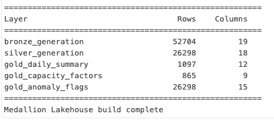
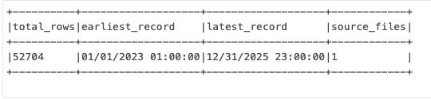
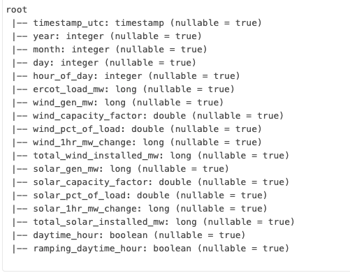
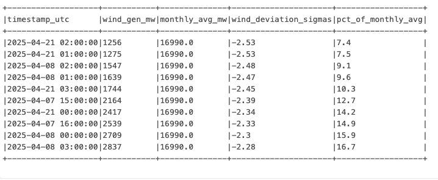
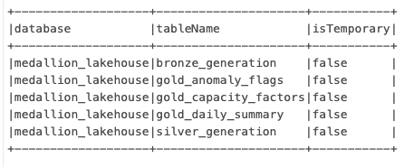

# ERCOT Renewable Generation — Medallion Lakehouse

A production-pattern Bronze → Silver → Gold lakehouse pipeline built on Databricks, processing 3 years of real ERCOT hourly wind and solar generation data into analytics-ready Delta tables — including real data quality decisions, UTC timezone handling, and statistical anomaly detection.


---

## Overview

This project implements a full medallion lakehouse architecture over publicly available ERCOT hourly aggregated wind and solar generation data (2023–2025). The pipeline processes raw Excel exports through three layers — Bronze (raw ingestion), Silver (cleaned and conformed), and Gold (analytics-ready aggregations) — using PySpark and Delta Lake on Databricks Community Edition.

The focus is on the data engineering decisions that real pipelines require: handling mixed row types from source Excel tabs, resolving Daylight Saving Time duplicate timestamps, fixing source data placeholder values, and building statistical anomaly detection into the Gold layer.

**Stack:** PySpark · Delta Lake · Databricks · Unity Catalog · SQL

**Data source:** Public: [ERCOT Hourly Aggregated Wind and Solar Output](https://www.ercot.com/gridinfo/generation)

---

## Architecture

```
ERCOT Public Excel Files (2023, 2024, 2025)
        ↓
Bronze Layer — raw ingestion, column rename, metadata
        ↓
Silver Layer — type casting, UTC conversion, join, dedup, quality fixes
        ↓
Gold Layer — daily summary · capacity factors · anomaly flags
```

### Layer summary



| Layer | Table | Rows | Description |
|---|---|---|---|
| Bronze | bronze_generation | 52,704 | Raw stacked rows, both wind and solar |
| Silver | silver_generation | 26,298 | One clean row per UTC hour |
| Gold | gold_daily_summary | 1,097 | One row per day |
| Gold | gold_capacity_factors | 865 | Hourly CF by year and month |
| Gold | gold_anomaly_flags | 26,298 | Per-hour statistical anomaly flags |

---

## Bronze layer

Reads the raw ERCOT source table, renames all columns from the original Excel format (spaces, special characters, `%` signs) to clean snake_case, adds ingestion metadata (`ingestion_timestamp`, `source_table`), and writes as a Delta table.



**Key decision:** Column renaming happens at Bronze, not Silver. Any downstream layer can read Bronze and immediately use clean column names without knowing the source schema quirks.

---

## Silver layer

The most complex layer — where real data quality decisions happen.



### Data quality issues found and resolved

**1. Mixed row types (stacked wind and solar)**

The ERCOT Excel file has separate Wind and Solar tabs. When uploaded, Databricks stacked them into one table — wind rows had null solar columns and vice versa. Resolution: split into separate DataFrames, clean each independently, join on timestamp.

**2. Solar nighttime placeholder values**

ERCOT uses `1` (not `0`) for solar generation during nighttime hours in the raw data. Resolution: replace `solar_gen_mw = 1` where `daytime_hour = False` with `0`.

**3. 96 empty rows**

96 rows had both `wind_gen_mw` and `solar_gen_mw` as NULL — header artifacts from the Excel structure. Resolution: filter robustly using `isNotNull() | isNotNull()` so future uploads are handled automatically, with a warning printed if any are dropped.

**4. Daylight Saving Time duplicate timestamps**

The fall-back hour (1:00 AM → 1:00 AM) produces two rows with identical timestamps on 3 dates per year (one per year in the dataset). Resolution: applied month and hour-based UTC offset logic to convert Central Time to UTC — CDT (UTC-5) for summer months, CST (UTC-6) for winter — then deduplicated remaining collisions keeping the higher-generation observation.

**Known limitation:** The ERCOT public file does not include a per-row timezone indicator. UTC conversion uses month-based offset approximation; the 6 DST transition rows where CDT/CST cannot be distinguished programmatically are deduplicated with one observation retained.

---

## Gold layer

Three purpose-built analytical tables, each answering a different business question.

### Gold 1 — Daily generation summary

One row per day with total MWh, average MW, and peak generation for both wind and solar. Useful for trend analysis, month-over-month comparisons, and capacity planning.

### Gold 2 — Capacity factors by hour and month

Shows the average generation efficiency (actual ÷ installed capacity) by hour of day and month. Reveals the temporal generation profile of wind vs solar — solar peaks midday, wind peaks overnight and in winter months in Texas.

### Gold 3 — Statistical anomaly flags

Flags hours where wind or solar generation fell more than 2 standard deviations below the monthly mean — a standard statistical threshold for identifying operationally significant generation shortfalls.



The 10 most extreme wind anomaly events are concentrated in April 2025, where wind generation dropped to as low as **7.4% of the monthly average** — consistent with documented wind drought events in ERCOT during that period. This demonstrates the pipeline producing real operational insight from public data, not synthetic results.

---

## Delta tables in Unity Catalog



All tables are registered in Unity Catalog under `workspace.medallion_lakehouse`, enabling governance, lineage tracking, and access control — the same pattern used in enterprise Databricks deployments.

---

## What I'd build next

- Add a dbt layer on top of Gold for further transformation documentation and testing
- Implement incremental Bronze ingestion using Delta's `MERGE` operation rather than full overwrite — critical for production pipelines processing daily ERCOT updates
- Add Great Expectations data quality checks between Bronze and Silver to catch schema changes in future ERCOT file formats automatically
- Build a Databricks Dashboard on the Gold layer for visual monitoring

---

## Run it yourself

All notebooks are in the `notebooks/` folder and run sequentially:

```
01_bronze_layer.py   → ingests raw data, renames columns, writes Bronze Delta table
02_silver_layer.py   → cleans, casts, converts to UTC, joins, writes Silver Delta table  
03_gold_layer.py     → builds three Gold analytical tables
```

**Requirements:** Databricks Community Edition (free) · ERCOT public data files (linked above)

**Data:** Download from [ERCOT EMIL portal](https://www.ercot.com/mp/data-products/data-product-details?id=PG7-126-M) — `ERCOT_2023/2024/2025_Hourly_WindSolar_Output.xlsx`

---

## Context

Built as a portfolio project demonstrating production-pattern medallion lakehouse architecture on real operational energy data. All data is publicly available from ERCOT with no usage restrictions.
